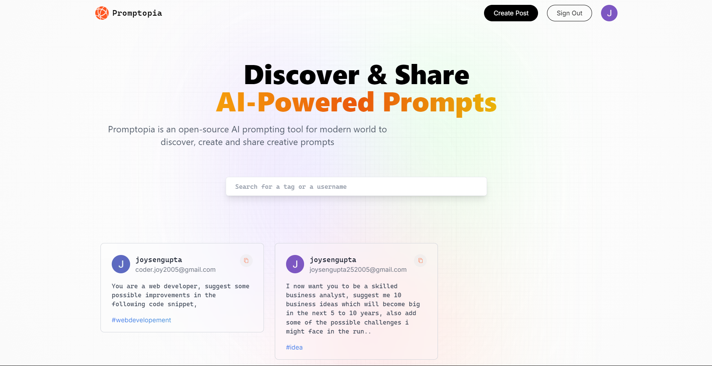
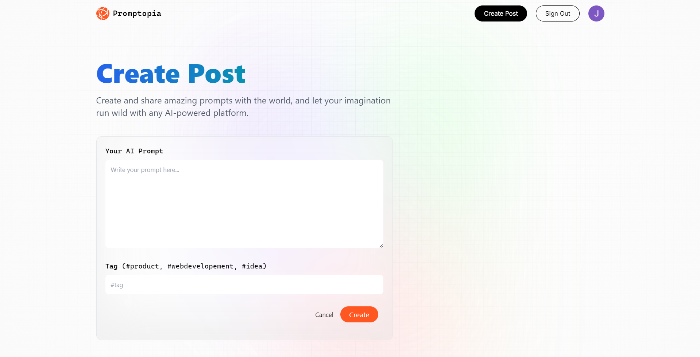
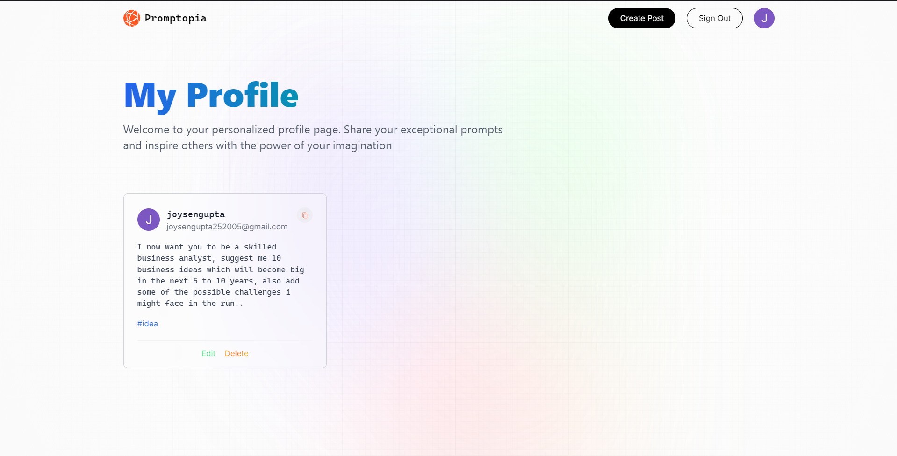

# Promptopia





Promptopia is a community-driven platform where users can share and discover AI prompts. Whether you're a seasoned AI enthusiast or just starting, Promptopia provides a space to post, explore, and connect with others through creative prompts.

## Table of Contents

- [Features](#features)
- [Technologies Used](#technologies-used)
- [Installation](#installation)
- [Usage](#usage)
- [Contributing](#contributing)
- [License](#license)
- [Screenshots](#screenshots)

## Features

- **User Authentication**: Sign up and log in to share and save your favorite prompts.
- **Post Prompts**: Easily create and post prompts to share with the community.
- **Explore Prompts**: Browse through a diverse collection of prompts shared by others.
- **Edit and Delete**: Manage your prompts by editing or deleting them as needed.
- **Profile Management**: View and edit your profile, including your shared prompts.

## Technologies Used

- **Frontend**: React.js, Next.js
- **Backend**: Node.js, Express.js
- **Database**: MongoDB
- **Authentication**: NextAuth.js
- **Styling**: Tailwind CSS

## Installation

To get started with Promptopia, follow these steps:

1. Clone the repository:
   ```bash
   git clone https://github.com/yourusername/promptopia.git
